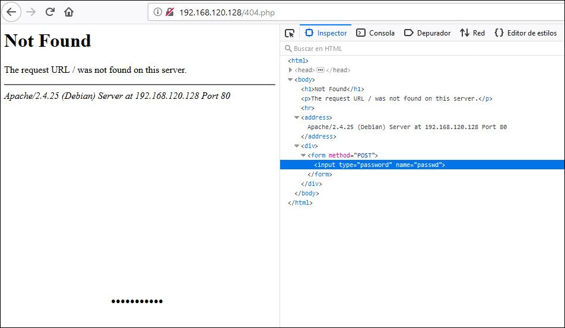
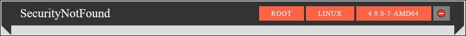
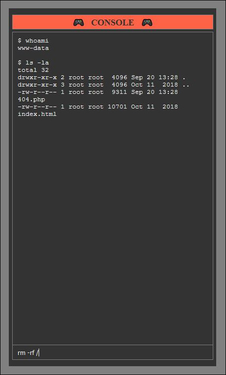
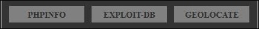

<h1 align="center">
  <br>
  
  <br>
  Security Not Found!
  <br>
</h1>

<h4 align="center">404 Page Not Found Webshell</h4>

<p align="center">
    <a href="https://coolors.co/dddddd-aaaaaa-808080-333333-ff6347" target="_blank">
      
    </a>
    
    <a href="https://github.com/CosasDePuma/SecurityNotFound/blob/master/LICENSE">
      
    </a>
</p>
<br>

:vhs: Clone me!
----
Clone or download the project:

```sh
git clone https://github.com/CosasDePuma/SecurityNotFound.git SecurityNotFound
cd SecurityNotFound
```

:package: "Installation"
----


The `src/404.php` file should be located on the target server.

That server must have the ability to execute `.php` files.

Here is an example of some of the most common routes on which servers are located:

```sh
# 🏁 Windows (Xampp)
C:\Xampp\htdocs\

# 🐧 Linux
/var/www/html/
```

> :warning:  Obviously, you and I know that you have legitimate access to that server.


:door: Access Granted!
---

Now, you can access it through the browser:

```sh
https://www.target.com/404.php
```

<br>
<p align="center"></p>
<br>

> :bulb: You can replace the server 404 error template to access from any invalid URL.

To access the control panel, press `TAB` key or search the password field using your browser's tools.

<br>
<p align="center"></p>
<br>

The default password is: `cosasdepuma`.

> :egg: You can leave the `$passphrase` variable in the script as an empty string to directly access the control panel. If it is your intention, you have lost my respect.

> :lock: To set a custom value, insert your password into the `$passphrase` variable after applying the ``MD5`` algorithm three consecutive times.

:wheel_of_dharma: Control Panel
---

<p align="center">
  
  
  
</p>


### Banner

| Function | Shown in the picture |
| --- | --- |
| Current user | root |
| Kernel | Linux |
| Release | 4.9.0-7-AMD64 |
| Exit Button | ⛔ |

> :bookmark: You can also log out using the `exit` parameter in a `GET` request.

### Buttons

| Name | Function |
| --- | --- |
| PHPINFO | Shows `phpinfo();` page. |
| EXPLOIT-DB | Searches for kernel-compatible exploits in `exploit-db.com`. |
| GEOLOCATE | It shows approximately in `Google Maps` the place where the server is physically located. |
| SELF-REMOVE | The shell deletes itself from the server. |

:scroll: Log Footprints
---

| # of lines in `access.log` | Action |
| --- | --- |
| 1 | Access without logging in |
| 1 | Access with the session already started |
| 2 | Log in |
| 2 | Log out |
| 2 | Execute a command through the console |
| 1 | Button: PHPINFO
| 0 | Button: EXPLOIT-DB
| 0 | Button: GEOLOCATE
| 2 | Button: SELF-REMOVE
| 1 | `Problem:` favicon.ico

:memo: TO-DO
---

- [ ] Roadmap
- [ ] Some marketing
- [ ] Contribution Template
- [ ] Fix Self-Remove (Linux)
- [ ] Prevent favicon.ico request
- [ ] Add "Thanx & Refs" in ReadMe
- [ ] Buttons to external page in new tab

:octopus: Support the developer!
----
Everything I do and publish can be used for free whenever I receive my corresponding merit.

Anyway, if you want to help me in a more direct way, you can leave me a tip by clicking on this badge:

<br>
<p align="center">
  <a href="https://www.paypal.me/cosasdepuma/">
    
  </a>
</p>
<br>

:earth_africa: Scheme of contents
----
```
SecurityNotFound
 < Repository >
|__ LICENSE
|__ README.md
|__ .assets
  |__ banner.jpg
  |__ buttons.jpg
  |__ console.jpg
  |__ hidepasswd.jpg
  |__ notfound.jpg
  |__ icon.png
< Soruce Code >
|__ src
  |__ 404.php
```


<!-- https://github.com/tennc/webshell/blob/master/php/wso/wso_404.php -->