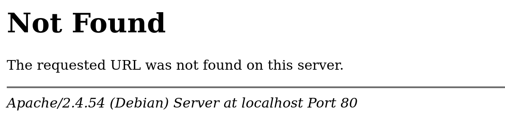
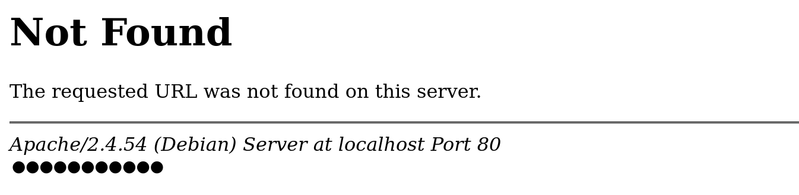
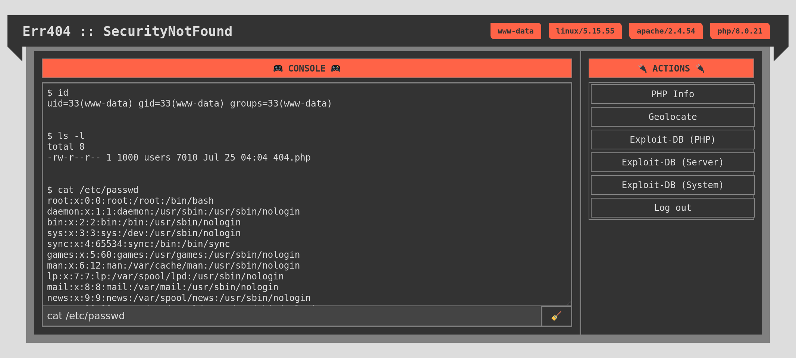

<div align="center">
  
  <h4>404 Page Not Found Webshell</h4>
  <br/>
</div>

<p align="center">
    
    <a href="https://github.com/CosasDePuma/SecurityNotFound/blob/master/LICENSE">
      
    </a>
</p>
<br>

## 📼 Clone me!

Clone or download the project:

```sh
git clone --depth=1 https://github.com/CosasDePuma/SecurityNotFound.git
```

## 📦 "Installation"

The `src/404.php` file should be located on the target server.

That server must have the ability to execute `.php` files.

Here is an example of some of the most common routes on which servers are located:

```sh
# 🏁 Windows (Xampp)
C:\Xampp\htdocs\

# 🐧 Linux
/var/www/html/
```

> :warning:  Obviously, you and I know that you have **legitimate** access to that server.


## 🚪 Access Granted!

Now, you can access it through the browser:

```sh
https://www.example.com/404.php
```

<br>
<p align="center"></p>
<br>

> 💡 You can replace the server 404 error template to access from any invalid URL.

To access the control panel, press `TAB` key or search the password field using your browser's tools:

<br>
<p align="center"></p>
<br>

The default password is: `cosasdepuma`.

> 🥚 You can leave the `$passphrase` variable in the script as an empty string to directly access the control panel.

> 🔒 To set a custom value, insert your password into the `$passphrase` variable after applying the ``MD5`` algorithm three consecutive times.

## 🎮 Control Panel

Once logged in, the webshell will show its real appearance:

<p align="center">
  
</p>

The panel features an AJAX console and a number of preconfigured actions:

| Name | Description |
| --- | --- |
| PHP Info | Shows `phpinfo();` page. |
| Geolocate | Shows in `Google Maps` the place where the server is physically located. |
| Exploit-DB (...) | Searches for compatible exploits in `exploit-db.com`. |
| Log out | Exits the dashboard. |

It should be noted that the execution of commands is performed using the **"Referrer"** header, its content being the executed payload.

This has two advantages: greater stealth within the log file and the ability to execute commands without the need to access the web interface.

<details>
<summary>access.log example</summary>

```log
172.18.0.1 - - [25/Jul/2022:04:52:17 +0000] "GET /404.php HTTP/1.1" 404 771 "-" "Mozilla/5.0 (X11; Linux x86_64; rv:102.0) Gecko/20100101 Firefox/102.0"
172.18.0.1 - - [25/Jul/2022:04:52:21 +0000] "POST /404.php HTTP/1.1" 404 3560 "http://localhost/404.php" "Mozilla/5.0 (X11; Linux x86_64; rv:102.0) Gecko/20100101 Firefox/102.0"
172.18.0.1 - - [25/Jul/2022:04:52:27 +0000] "GET /404.php HTTP/1.1" 404 375 "-" "Mozilla/5.0 (X11; Linux x86_64; rv:102.0) Gecko/20100101 Firefox/102.0"
172.18.0.1 - - [25/Jul/2022:04:52:31 +0000] "GET /404.php HTTP/1.1" 404 470 "-" "Mozilla/5.0 (X11; Linux x86_64; rv:102.0) Gecko/20100101 Firefox/102.0"
172.18.0.1 - - [25/Jul/2022:04:52:37 +0000] "GET /404.php?p HTTP/1.1" 404 75790 "http://localhost/404.php" "Mozilla/5.0 (X11; Linux x86_64; rv:102.0) Gecko/20100101 Firefox/102.0"
172.18.0.1 - - [25/Jul/2022:04:52:41 +0000] "GET /404.php HTTP/1.1" 404 3560 "-" "Mozilla/5.0 (X11; Linux x86_64; rv:102.0) Gecko/20100101 Firefox/102.0"
172.18.0.1 - - [25/Jul/2022:04:52:43 +0000] "GET /404.php?c HTTP/1.1" 302 373 "http://localhost/404.php" "Mozilla/5.0 (X11; Linux x86_64; rv:102.0) Gecko/20100101 Firefox/102.0"
172.18.0.1 - - [25/Jul/2022:04:52:43 +0000] "GET /404.php HTTP/1.1" 404 771 "http://localhost/404.php" "Mozilla/5.0 (X11; Linux x86_64; rv:102.0) Gecko/20100101 Firefox/102.0"
```

</details>

## 📜 Log Footprints

| # of lines in `access.log` | Action |
| --- | --- |
| 1 | Access without logging in |
| 1 | Access with the session already started |
| 1 | Log in |
| 2 | Log out |
| 1 | Execute a command through the console |
| 1 | Plugin: PHP Info
| 0 | Plugin: Geolocate
| 0 | Plugin: Exploit-DB (...)

## 🐙 Support the developer!
----
Everything I do and publish can be used for free whenever I receive my corresponding merit.

Anyway, if you want to help me in a more direct way, you can leave me a tip by clicking on this badge:

<br>
<p align="center">
  <a href="https://www.paypal.me/cosasdepuma/">
    
  </a>
</p>
<br>